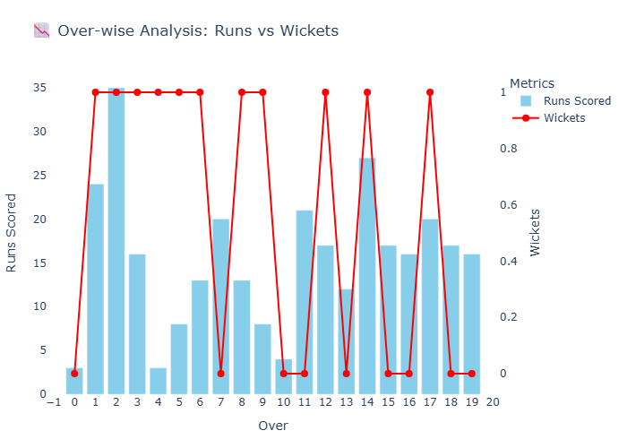
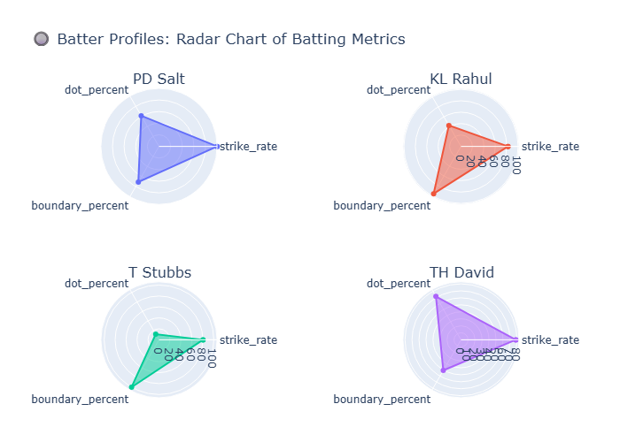

# IPL Batting Analysis 🏏

## 📌 Project Overview
This project analyzes IPL batting performances using Python. batting intent reflects how aggressively a player approaches different phases of the game. In this article, I’ll perform a detailed Batting Intent Analysis with Python using ball-by-ball data from a recent IPL match between RCB and DC in 2025.
It explores player statistics, phases of the game (Powerplay, Middle Overs, Death Overs),  
and provides insights into batter profiles, strike rates, and match impact.


## ⚙️ Installation
1. Clone this repository:
   ```bash
   git clone https://github.com/Tasleem0501/ipl-batting-analysis.git
   cd ipl-batting-analysis


## 📊 Results

Over-wise Analysis: Runs vs Wickets



 chart :


